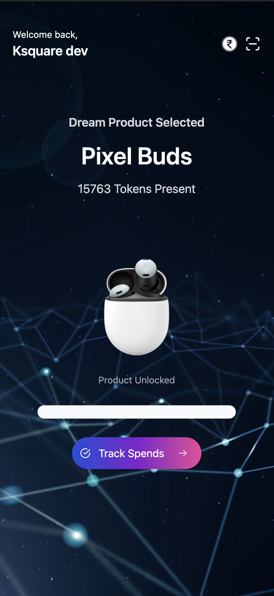
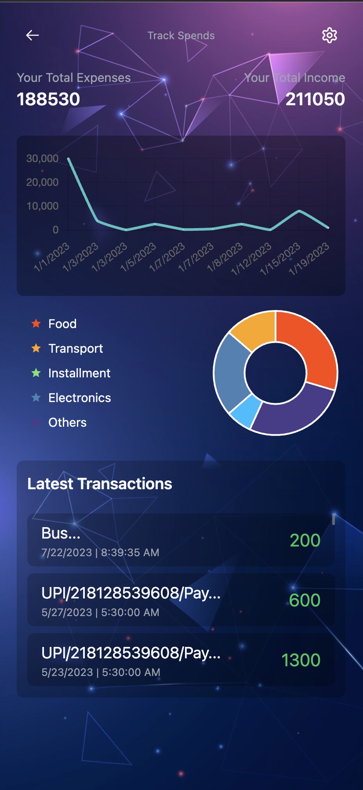
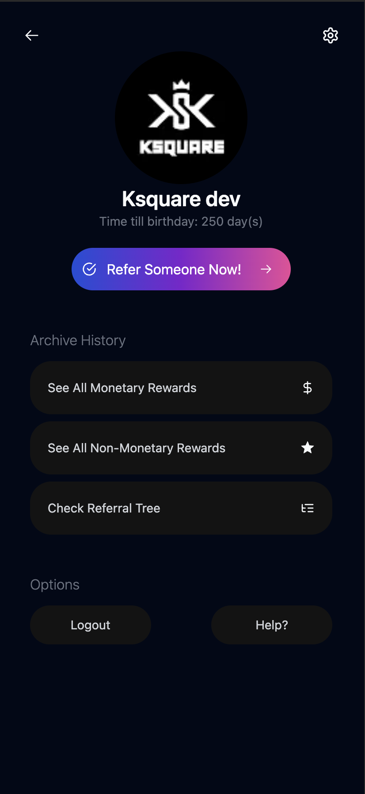

# FinTrack

FinTrack is a financial management app that helps you keep track of your expenses and income. It provides reward points for every transactionmade which can be redeemed for various offers and discounts.

## Tech Stack

**NextJs, TailwindCSS, ShadcnUI, RadixUI, MongoDB, NextAuth(Google Auth API)**

## Run Locally

Clone the project

```bash
  git clone https://github.com/itsksquare/FinTrack.git
  or
  gh repo clone itsksquare/FinTrack
```

Go to the project directory

```bash
  cd FinTrack
```

Install dependencies

```bash
  npm install
```

Start the server

```bash
  npm run dev
```

## Screenshots

<p align="center">
    
    
    
</p>
